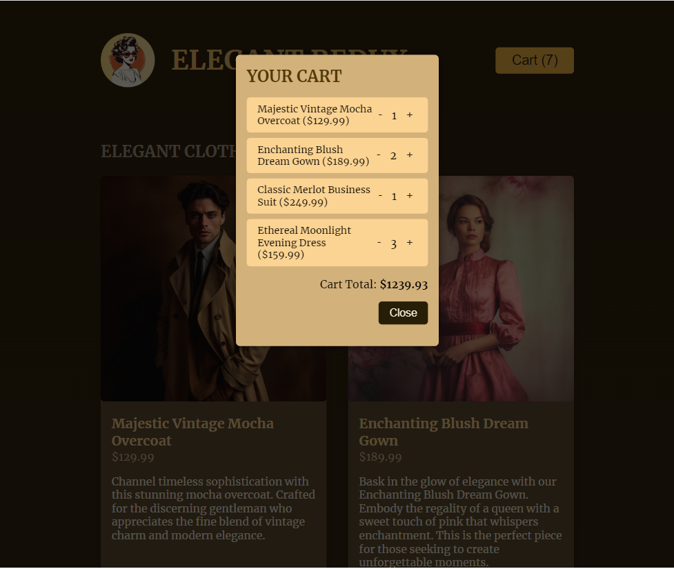

# E-Store React/TypeScript/Redux demo 

  ## Description

  A demo storefront application built with React, TypeScript, Redux which allows users to add items to a cart, remove items from the cart and to view their cart along with prices and totals

  ### App Screenshots
  
  

  
  
  ## Table of Contents
  
  - [Installation](#installation)
  - [Usage](#usage)
  - [License](#license)
  - [Contributing](#contributing)
  - [Tests](#tests)
  - [Questions](#questions)
  
  ## Installation
  
  Deployed URL: https://billstephens2022.github.io/EStore-React-TypeScript-Redux-Demo/
  
  ## Usage
  
  Go to Deployed URL, view product cards and add items to cart using the buttons on the cards.  Click Cart icon to view the full cart, where you can also amend quantities.

  ## License
This application is covered under the MIT License.
 For more information: https://opensource.org/licenses/MIT
  
  ## Contributing
  N/A
  
  ## Tests
  N/A

  ## Questions
  Contact Info 
  GitHub user name: BillStephens2002 
  Link to GitHub profile: https://github.com/BillStephens2002 
  Email: stephensbill17@gmail.com